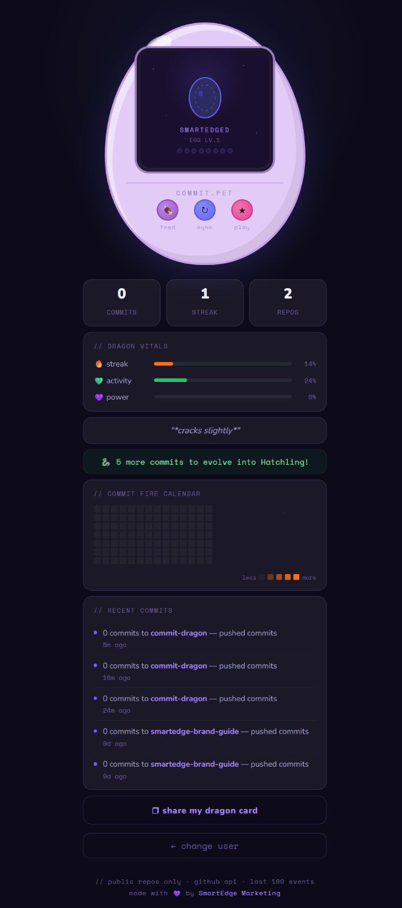

# 🐉 Commit Dragon

**Code Developer Tamagotchi-Style Digital Pet Dragon.**

The more you code, the more your dragon grows. Watch it evolve based on your GitHub commits.

Interactive developer pet built with vanilla HTML/CSS/JS — connects to the GitHub API to track commit activity and evolve your dragon through 5 stages.

> *Your coding companion. Feed it commits, watch it evolve.*

---

## 🕹 Live Demo

👉 **[SmartEdgeDM.github.io/commit-dragon](https://SmartEdgeDM.github.io/commit-dragon)**

---



---

## ✨ Features

- Tamagotchi-style egg shell with animated glowing screen
- 5 dragon evolution stages driven by real GitHub commit data
- **Evolution animation** — dramatic glow effect when your dragon levels up
- **🐉 Dragon mood system** — dragon reacts based on how many days since your last commit
- **🔥 Commit fire calendar** — GitHub-style contribution graph with fire heat levels
- **Share card** — download a shareable image of your dragon's current stage
- Live GitHub API integration — no login required
- Working buttons: Feed, Sync, and Play
- 8-bit sound effects for every interaction
- Dragon vitals: streak, activity, and power bars
- Recent commit feed with repo names and timestamps
- Dragon egg favicon in the browser tab
- SmartEdge brand colors throughout
- Built with zero dependencies — pure HTML, CSS & JS

---

## 😤 Dragon Mood System

Your dragon's mood changes based on how many days have passed since your last commit. Neglect your dragon and it will let you know!

| Mood | Days Since Last Commit | What Happens |
|------|----------------------|--------------|
| 😄 Happy | Today | Dragon floats cheerfully — thriving! |
| 😊 Content | Yesterday | Normal float — still going strong |
| 😤 Hungry | 3+ days | Dragon wiggles anxiously, egg dims |
| 😩 Starving | 7+ days | Egg fades further, dragon pleads on screen |
| 😴 Dormant | 14+ days | Egg goes grey, dragon barely moves |

---

## 🐣 Evolution Stages

| Stage | Commits Needed |
|-------|---------------|
| 🥚 Egg | 0 |
| 🐣 Hatchling | 5+ |
| 🦎 Wyrmling | 20+ |
| 🐲 Drake | 60+ |
| 🐉 Elder Dragon | 150+ |

---

## 🛠 How to Use

1. Open the [live site](https://SmartEdgeDM.github.io/commit-dragon)
2. Enter any GitHub username and hit **Summon**
3. Use the buttons to interact:
   - 🍖 **Feed** — your dragon reacts with a happy animation
   - ⟳ **Sync** — fetches fresh data; triggers evolution animation if you levelled up
   - ★ **Play** — your dragon spins with joy
4. Hit **share my dragon card** to download a shareable PNG

---

## 📁 Files

```
commit-dragon/
├── index.html          # entire app — single file, zero dependencies
├── screenshot.png      # repo preview screenshot
├── social-preview.png  # og:image for social sharing
├── CHANGELOG.md
├── CONTRIBUTING.md
├── CODE_OF_CONDUCT.md
├── LICENSE
└── README.md
```

> **Note:** Only public repositories are visible via the GitHub API. Private repo activity won't count toward your dragon's XP.

---

## 🤝 Contributing

We welcome contributions! Please read [CONTRIBUTING.md](CONTRIBUTING.md) before submitting a pull request.

---

Made with 💜 by [SmartEdge Marketing](https://SmartEdgeDM.com) · [](https://buymeacoffee.com/smartedge)
